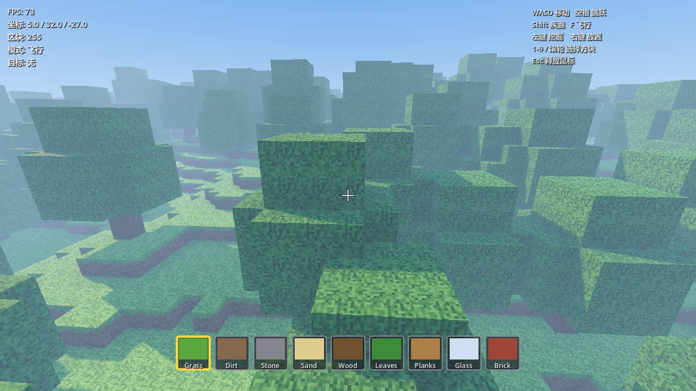

# minecraft-like-godot

一个用**纯 GDScript** 实现的体素沙盒原型（Minecraft-like），基于 Godot 4。

世界无限延伸、地形程序化生成、区块流式加载，方块可自由挖掘与放置。**项目不依赖任何外部美术资源**——所有方块贴图在运行时由代码程序化绘制成一张 4×4 图集。



## 特性

- **无限程序化地形**：丘陵（Simplex 分形噪声）+ 山脉（低频噪声阈值抬升）+ 洞穴（3D Perlin 噪声）+ 树木（哈希散点）
- **生物群系分层**：海平面以下为沙滩、低地为草地、海拔 34 以上为雪地、地下为石头与基岩
- **水体**：海平面（`WATER_LEVEL = 18`）以下自动填充水，水面独立网格 + 半透明材质
- **区块流式加载**：按距离由近到远生成，超出保留半径自动卸载，单帧有时间预算（不卡帧）
- **贪心网格生成**：使用「填充数组 (pad)」把邻域体素摊平到连续数组，面剔除与环境光遮蔽退化为纯索引运算
- **环境光遮蔽 (AO)**：逐顶点采样两个边 + 一个角，配合按面的方向光照系数写入顶点色
- **真实碰撞**：固体网格生成 trimesh 碰撞体，玩家为胶囊 `CharacterBody3D`
- **体素 DDA 射线检测**：用于挖掘/放置的精准拾取，最多 256 步
- **第一人称控制器**：行走 / 疾跑 / 跳跃 / 飞行，方块高亮框
- **日夜循环**：300 秒一天，天空、雾、环境光、太阳颜色与强度随时间插值
- **内置 HUD**：准星、9 格快捷栏、调试信息（FPS / 坐标 / 区块数 / 目标方块）、操作提示
- **烟测脚本**：约 45 项断言，覆盖几何正确性、地形、射线、物理、移动与流式加载

## 目录结构

```
minecraft-like-godot/
├── project.godot            # 引擎配置（主场景、Jolt 物理、Forward Plus）
├── scenes/
│   └── main.tscn            # 主场景（仅挂载 scripts/main.gd）
├── scripts/
│   ├── main.gd              # 组装世界/玩家/HUD/光照，注册输入映射，日夜循环
│   ├── voxel_world.gd       # 体素世界：地形生成、区块调度、读写、射线检测
│   ├── chunk.gd             # 单个区块：pad 构建、网格生成、AO、碰撞体
│   ├── block_types.gd       # 方块 ID 枚举与属性表（贴图槽位/实心/不透明/名称/颜色）
│   ├── player.gd            # 第一人称控制器：移动、飞行、挖掘、放置
│   ├── hud.gd               # CanvasLayer 界面
│   └── texture_atlas.gd     # 运行时程序化生成 4×4 贴图图集
└── tests/
    └── smoke_test.gd        # 无头烟测（extends SceneTree）
```

## 运行

**需要**：Godot 4（Forward Plus 渲染器，Jolt Physics）。

- **编辑器打开**：用 Godot 导入 `project.godot`，直接按 F5 运行（主场景已设为 `res://scenes/main.tscn`）。
- **命令行运行**：

```bash
godot --path . 
```

**运行烟测**（无头模式，进程退出码非 0 表示有失败项）：

```bash
godot --headless --script res://tests/smoke_test.gd
```

## 操作

| 输入 | 行为 |
| --- | --- |
| `W` `A` `S` `D` | 移动 |
| `空格` | 跳跃（飞行时上升，按住 `Ctrl` 下降） |
| `Shift` | 疾跑（飞行时 1.8× 加速） |
| `F` | 切换飞行 / 行走 |
| `鼠标左键` | 挖掘方块（冷却 0.15s，射程 6） |
| `鼠标右键` | 放置当前方块（冷却 0.2s） |
| `1`–`9` / `滚轮` | 选择快捷栏方块 |
| `Esc` | 释放鼠标（再点击画面重新捕获） |

快捷栏：草地、泥土、石头、沙子、木头、树叶、木板、玻璃、砖块。

## 关键参数

调参入口集中在两个文件的常量区。

`scripts/voxel_world.gd`：

| 常量 | 默认 | 说明 |
| --- | --- | --- |
| `SIZE` / `HEIGHT` | 16 / 48 | 区块水平尺寸 / 世界高度 |
| `WATER_LEVEL` | 18 | 海平面高度 |
| `VIEW_RADIUS` | 6 | 生成网格的区块半径 |
| `DATA_RADIUS` | 7 | 生成体素数据的区块半径（须比 `VIEW_RADIUS` 大 1，供 AO 采样） |
| `KEEP_RADIUS` | 10 | 超出该半径的区块卸载 |

`scripts/main.gd`：

| 常量 | 默认 | 说明 |
| --- | --- | --- |
| `DAY_LENGTH` | 300.0 | 一整天的秒数 |

`scripts/chunk.gd` 中的 `FACE_LIGHT`（按面方向光照系数）与 `scripts/player.gd` 中的速度常量同样可直接修改。

## 实现要点

### 网格生成为什么快

`chunk.gd` 先把本区块与 8 个邻域的一圈边界体素复制进 `(SIZE+2) × (HEIGHT+2) × (SIZE+2)` 的 `PackedByteArray`（即 `_build_pad()`），之后：

- 邻域查询变成 `pad[i + N_OFF]` 的加法，没有函数调用与边界判断；
- AO 采样变成三次 `pad[...]` 查表；
- 先用 `tops` 数组记录每列最高非空方块，跳过整根空气柱。

代价是 `DATA_RADIUS` 必须比 `VIEW_RADIUS` 大 1——否则边界体素缺失会导致 AO 出错，因此 `VoxelWorld._neighbors_ready()` 会等 8 邻域数据就绪才建网格。

### 面剔除规则

邻居不为空气时：邻居**不透明**则剔除该面；邻居与当前方块**同 ID**也剔除（避免水/玻璃内部产生无数看不见的面）。水与非水方块分成两趟生成，各自独立成网格。

### 缠绕方向

Godot 的正面为顺时针缠绕（与 `PlaneMesh` 一致），所以索引顺序与面外法线方向相反；同时按 AO 强弱切换四边形的对角线分割，避免明暗接缝。`tests/smoke_test.gd` 会逐三角形校验这一点。

### 单帧预算

`VoxelWorld._process()` 分三步并各自带时间上限：脏区块重建（每帧最多 4 个）→ 体素数据生成（6ms）→ 网格生成（9ms）；每 2 秒检查一次卸载。

## 已知限制

- 世界不持久化：编辑与地形都是运行时内存数据，退出即丢失。
- 世界高度固定 48 格，未实现纵向无限。
- 树叶、玻璃等方块的剔除规则较简化（玻璃不透明判定为 0，会出现相邻玻璃间的可见面）。
- 无多人、无存档、无实体/掉落物系统——定位是引擎与渲染的原型底座。
